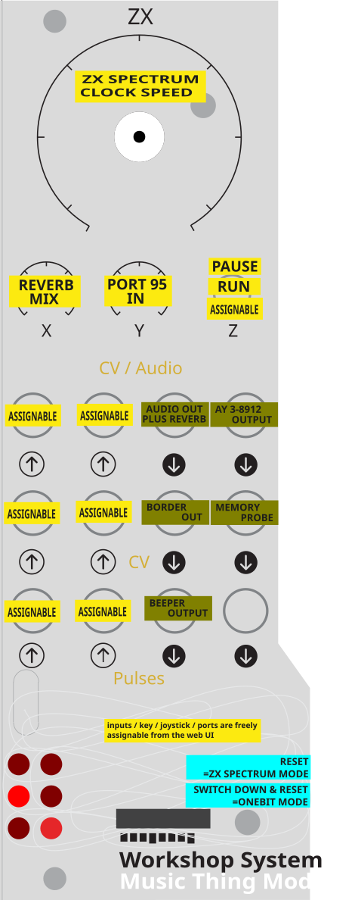
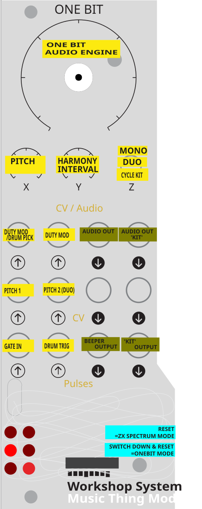

# ZX + OneBit — for the Music Thing Workshop Computer

**A ZX Spectrum inside your modular.**
Patch gates and CV into Spectrum games and programs.
Patch the beeper, border, AY sound and live memory back out.

A program card for the **Music Thing Modular Workshop System Computer** that carries
**two different instruments in one firmware**, chosen at power-on:

- **ZX** — a cycle-accurate **ZX Spectrum 128K** (Z80 + ULA + banked memory + AY sound
  chip) that turns the module's jacks, knobs and switch into a two-way bridge between
  the modular and the machine: play games/demos, load snapshots and `.ay`/`.pt3`
  chip-music,
  drive the keyboard from CV/gates or a laptop, read patched CV back as data inside a
  Spectrum program, and take beeper/border/AY out as CV and audio.
- **OneBit** — a 1-bit "beeper synth" that ports classic ZX-Spectrum beeper-music
  engines. A playable modular voice with pitch CV, gate, duophony and drums.

They're thematically adjacent but **used quite differently**, so their controls and
jack mappings are documented separately below.

Runs on a real Workshop Computer. Built on the RP2040.

## Choosing a mode at boot

| At power-on… | Boots |
|--------------|-------|
| Normal (switch not held) | **ZX Spectrum** |
| **Hold the momentary switch Down** through startup (~½ sec) | **OneBit** |

(ZX runs at 200 MHz, OneBit at 144 MHz; the boot dispatcher sets the clock for
whichever you choose.)

## Panel overlays

Printable panel overlays for both modes are in [`panels/`](panels/) — they label
every knob and jack for the mode. The panels below are the quick reference.

| ZX Spectrum mode | OneBit mode |
|:---:|:---:|
|  |  |

---

# Mode 1 — ZX Spectrum

## What it does

- **Cycle-accurate Z80** at the true emulated rate — 3.5469 MHz (128K) or 3.5 MHz
  (real 48K timing when a 48K program is loaded).
- **128K Spectrum**: 128 KB banked RAM, 32 KB ROM, `0x7FFD` paging, the ULA
  (`0xFE` beeper/border), and the **AY-3-8912** (3 tones + noise + 8 envelope shapes).
  48K programs run too.
- **Loads** `.z80` (v1/v2/v3, 48K & 128K), `.sna` (48K/128K) snapshots, and
  `.ay` / `.pt3` (Vortex Tracker) chip-music. AY tunes run their own Z80 player on
  the emulated CPU; PT3 modules run against an embedded PT3 player — both via a
  self-contained IM2 harness. Everything decodes **in the browser** and streams to
  the card, so any size fits.
- **AY-3-8912** uses the **measured** real-chip volume curve, so tunes play at correct
  pitch, timing, envelopes and a faithful tone/noise balance.
- A **baked-in default** program boots at power-on (built from
  `snapshots/bakedasm.z80`); with none present it boots the 128K menu.
- **Reverb** (Freeverb-style) on the beeper+AY mix, wet/dry on Knob X.

## Panel (ZX)

| Control | Function |
|---------|----------|
| **Knob Main** | Emulation **speed** — centre **deadzone** = exactly 100% / real time (speed shifts pitch, so the detent holds true speed). Applies to snapshots and `.ay`. |
| **Knob X** | **Reverb** wet/dry (on Audio Out 1) |
| **Knob Y** | Readable by the Z80 at **port `0x5F`** (`IN 95` in BASIC) |
| **Switch Up** | **Pause** (also the moment to use the Web UI) |
| **Switch Middle** | **Run** |
| **Switch Down** | A **mappable momentary keypress** |

## Inputs (ZX)

Every jack + the switch is **mapped in the Web UI** to one of: a **key** (held while
the input is active), a **Kempston** joystick direction, a **Z80-readable port** (the
input's live 0–255 value), an **AY mangle** target (see below), or **None**. A jack only
acts when something is patched in.

| Jack | Default | Mappable to |
|------|---------|-------------|
| **Pulse In 1** | ENTER | key / Kempston / port / AY mangle / none |
| **Pulse In 2** | SPACE | key / Kempston / port / AY mangle / none |
| **CV In 1** | Q  | key / Kempston / port / AY mangle / none |
| **CV In 2** | A | key / Kempston / port / AY mangle / none |
| **Audio In 1** | O | key / Kempston / port / AY mangle / none |
| **Audio In 2** | P | key / Kempston / port / AY mangle / none |
| **Switch Down** | ENTER | key / Kempston / port / AY mangle / none |

**Input ports** (read with `IN A,(port)` when a source is mapped to *Port*):
Knob Y `0x5F` (95), Pulse In 1 `0x23` (35), Pulse In 2 `0x27` (39), CV In 1 `0x2B` (43),
CV In 2 `0x2F` (47), Audio In 1 `0x33` (51), Audio In 2 `0x63` (99), Switch `0x67` (103).

These port numbers are chosen so the emulated machine can never mistake them for real
hardware: each has bits 0, 1 and 5 set, which keeps them clear of the ULA (even ports),
Kempston (bit 5 = 0) and — importantly — the 128K paging latch (bit 1 = 0), so a stray
`OUT` can't repage RAM under your program. Read them with a **high byte below `0x80`**
(`IN A,(n)` with a small `A`, or `IN r,(C)` with `B` < `0x80`); above that the AY claims
the address. A source that isn't mapped to *Port* reads `0xFF`, like the floating bus.

### Mangling the AY (`.ay` / `.pt3` playback)

While the card is playing an `.ay`/`.pt3`, a jack can be mapped to an **AY mangle**
target — live CV control over the sound chip itself, on top of whatever the tune is
doing. These targets are **inert in ZX game mode**, so one mapping table serves both.

| Target | What the CV does |
|--------|------------------|
| **A / B / C duty** | Reshapes that channel's square wave — PWM the real chip can't do. Centre = the normal 50% square; moving the CV **either way** thins the pulse toward a nasal, reedy tone |
| **Envelope** | Scales the envelope period by up to **±2 octaves** either side of whatever the tune set |
| **Noise** | Bends the noise period — grit and pitch on the noise channel |
| **A / B / C mute** | Gate-mutes a channel while the input is active (drop the bass, solo a lead) |

Duty, envelope and noise are **continuous** — they follow the CV, centred so that 0 V
(or an unpatched jack) means "no change". Each has a **mangle depth** slider in the Web
UI setting how far the CV pushes it. Mute is a **gate**: it mutes while the input is
high (invertible).

Two details that make these playable rather than merely correct. **Duty folds** around
centre because a square's timbre is symmetric about 50% — 25% and 75% sound identical —
so a straight sweep would spend half its travel repeating itself. **Envelope scales by
ratio, not by a fixed offset**, so you get the same musical interval whatever period the
tune programmed; an offset would slam to the limit on the short periods most PT3s use
and do nothing on long ones.

Playback is bit-identical to the unmangled tune until you actually patch something in.

## Write your own — a Spectrum program in the CV world

The real point of ZX mode is to **write a ZX Spectrum program that interfaces with the
modular** — read patched CV/gates (as keypresses, joystick, or values on the input
ports), do whatever you like in Z80, and drive the beeper / border / AY / memory-probe
CV back out. Write it in BASIC or assembly, assemble/save a `.z80` (or `.sna`), and
either upload it over the Web UI or bake it in as the default.

The baked-in default demo is exactly this — its source is
[`BakedASM.asm`](BakedASM.asm), a small Z80 program that:
- scans the **keyboard** (so it responds to whatever CV/gates you've mapped to keys),
- reads **Port 95** (`IN A,(95)` = Knob Y) and uses it to modulate the sound, and
- bangs the **beeper** (`OUT (254),A`) → Pulse Out 1.

That's the whole loop — modular in → Spectrum logic → audio/CV out — in ~40 lines.
Start from it. (`snapshots/bakedasm.z80` is the assembled version that gets baked in.)

### More worked examples — `FLASHME/DEMO-SFX*`

Four further demos live in [`FLASHME/`](FLASHME/), each as source + assembled
snapshot (`DEMO-SFX2.asm` / `DEMO-SFX2.z80`, and so on), so you can hear one and
then read exactly how it works. Upload the `.z80` over the Web UI.

> **These are examples, not instruments.** They exist to show *techniques* — how to
> read a jack, how to build an oscillator in Z80, how to get a signal back out — not
> because they sound good. Several are harsh, some are barely musical, and one is
> deliberately a bit broken (see SFX4 below). Treat them as annotated code you can
> hear, and raid them for parts.

| Demo | What it is |
|------|-----------|
| [`DEMO-SFX2`](FLASHME/DEMO-SFX2.asm) | **Six key-triggered SFX engines.** Q = VCA decay ping, A = PWM, O = binary rhythmic gating (AM), P = hard-sync vocal formants, SPACE = LFSR noise clock-divider, ENTER = arpeggiator. Knob Y (port 95) does something different in each — envelope length, duty cycle, bitmask, master pitch, sample rate, interval |
| [`DEMO-SFX3`](FLASHME/DEMO-SFX3.asm) | **Six more, all time-evolving.** Q = riser/siren (pitch climbs while held), A = portamento glide, O = charging-capacitor density builder, P = LFO pulse-width sweep, SPACE = sequencer play, ENTER = bitcrush texture morph |
| [`DEMO-SFX4`](FLASHME/DEMO-SFX4.asm) | **CV-driven oscillator / audio mangler.** Pitch from CV In 1, hard sync on Pulse In 1, FM from Knob Y, PWM threshold from Audio In 2, ring-mod invert from Pulse In 2. Switch Down swaps to an audio-thru mode where Audio In 1 gets bitwise-ANDed with CV In 2 (brutal bitcrushing) |
| [`DEMO-SFX5`](FLASHME/DEMO-SFX5.asm) | **Turing-machine sequencer.** Two 8-bit phase accumulators (CV In 1 / CV In 2), each hard-syncable from its Pulse In. Phase A doubles as the shift-register clock divider; the bit shifted in comes from comparing Audio In 1 against Audio In 2. Switch picks continuous morphing vs. stepped CV. Writes to screen memory so **CV Out 2's memory probe** carries the sequence |

**Set up the input mapping first.** `DEMO-SFX4` and `SFX5` read the input *ports*, so
in the Web UI each jack you want to use must be mapped to **→ Port** — otherwise they
read the idle `0xFF`/centre value and nothing appears to respond. `DEMO-SFX2`/`3` are
keyboard-driven instead, so map jacks to **keys** for those.

`DEMO-SFX4`'s oscillator is an **8-bit phase accumulator**: CV In 1 is added straight
to the byte that *is* the saw wave, so pitch ≈ looprate × CV / 256. The Z80 loop runs
at roughly 18 kHz, putting CV 1 at about 70 Hz and CV 64 around 4.5 kHz. The lower
part of the CV sweep is the musically useful bit — past CV ~128 you're above the
loop's Nyquist and the tone aliases into grit, which is either a bug or a feature
depending on what you're after.

(Accumulator width is the whole ballgame here: routing the same CV through a 16-bit
accumulator divides pitch by 65536 instead of 256 and caps the oscillator around
70 Hz — a slow thump rather than a tone.)

## Outputs (ZX)

| Jack | Function |
|------|----------|
| **Pulse Out 1** | **Beeper** |
| **Pulse Out 2** | MIC / tape line |
| **CV Out 1** | **Border** voltage |
| **CV Out 2** | **Memory probe** — a chosen RAM byte (0–255) as 0–5 V (address set in the Web UI; default 16384 = screen memory) |
| **Audio Out 1** | **Reverb** (beeper + AY mix), wet/dry on Knob X |
| **Audio Out 2** | **AY-3-8912** sound |
| **LEDs** | Left: mode (128K / 48K / AY). Right: heartbeat / correct-speed / beeper |

## Web UI (ZX)

USB-MIDI / WebMIDI SysEx — **Chrome or Edge**, no install.

> **Open the web app: <https://uglifruit.github.io/WorkshopZX/interface.html>**
> (or the local [`interface.html`](interface.html) copy). Chrome/Edge, plug the card
> into USB, click **Connect**. Pause the card (switch Up) while uploading.

- **Upload** `.z80` / `.sna` / `.ay` / `.pt3`.
- **Remap** inputs on a clickable QWERTY keyboard, with **Kempston**, **→ Port** and
  **✕ None** targets.
- **Keyboard passthrough** — type into the Spectrum. **Shift** = CAPS SHIFT,
  **Alt** = SYMBOL SHIFT, **Shift+0** or **Backspace** = DELETE.
- Set the **CV Out 2 memory-probe** address.

---

# Mode 2 — OneBit

A 1-bit beeper synth: a single fast-bitbanged output makes the tone, with
pseudo-polyphony faked by interleaving/XOR-ing squares — the classic ZX beeper trick.
Seven selectable engines (faithful ports of well-known Spectrum beeper routines) plus
drums. 

Boot OneBit by holding the switch **Down** at power-on.

## Panel (OneBit)

| Control | Function |
|---------|----------|
| **Knob Main** | **Engine × decay** — seven engine bands (Beep → PlipPlop → Tritone → Qchan → Phaser → Savage → Music Box); *within* each band the knob sweeps note-decay short → long |
| **Knob X** | **Root pitch** (~C1–C6), summed with CV In 1 |
| **Knob Y** | *Switch Up:* voice-2 interval (far CCW = solo, then unison / m3 / M3 / P5 / dom7 / octave). *Switch Middle:* a per-engine **timbre** control (Phaser detune / Savage skew depth) |
| **Switch Up** | Duophonic — voice 2 = CV In 1 root + Knob Y interval |
| **Switch Middle** | Duophonic — voice 2 = **CV In 2** (its own 1V/oct); Knob Y = timbre |
| **Switch Down** | Momentary tap **cycles the drum kit** (Click → Tritone → PCM → Synth) |

## Inputs (OneBit)

| Jack | Function |
|------|----------|
| **CV In 1** | **Voice 1 pitch**, 1V/oct (+ Knob X) |
| **CV In 2** | **Voice 2 pitch**, 1V/oct (in Switch Middle) |
| **Audio In 1** | Duty / pulse-width mod; **also latches the drum select** at each Pulse In 2 edge (low = kick … high = snare) |
| **Audio In 2** | Duty / timbre mod |
| **Pulse In 1** | **Note gate** — rising edge triggers the envelope, **held sustains**, falling releases |
| **Pulse In 2** | **Drum trigger** (drum chosen by Audio In 1) |

## Outputs (OneBit)

| Jack | Function |
|------|----------|
| **Pulse Out 1** | 1-bit **tone** (the true bitbanged beeper output) |
| **Pulse Out 2** | 1-bit **drum** lane |
| **Audio Out 1** | Tone density (PCM-style monitor of the tone) |
| **Audio Out 2** | Drum density |
| **LEDs** | Left (0/2/4) = **engine number in binary** (0–6). Right = note-decay glow (1) / drum kit (3) / drum activity (5) |

*(OneBit uses no Web UI. See its own repo, **<https://github.com/uglifruit/OneBit>**,
for the full details, build history (DEVLOG) and per-engine credits — that repo is
OneBit's standalone development home; the engine here is the same code reused as a
boot mode.)*

---

# Under the hood (ZX)

`ProcessSample()` runs at 48 kHz — far too slow to *be* the 3.5 MHz Z80 clock — so
work is split across the RP2040's two cores (the repo's `second_core` pattern):

| Core | Job |
|------|-----|
| **Core 1** | Free-runs the Z80 + ULA + AY, paced to emulated Spectrum time; also services USB. |
| **Core 0** | 48 kHz I/O: latches beeper/AY/border to the outputs, samples the inputs, runs the mapping engine + reverb, presents keyboard/joystick/port state to the Z80. |

They meet through a small lock-free `CrossCore` struct (single-writer per field). An
instruction-stepped Z80 core keeps it real-time from flash. Emulator setup runs **on
core 1**, never in the ComputerCard constructor (which would wedge the chip).

## Building

Raspberry Pi Pico SDK (2.2.0):

```sh
cmake -B build -G Ninja
cmake --build build
```

Produces `build/zx.uf2`. Hold BOOTSEL on the Computer's RP2040 and drop it on the
mounted drive. ROM headers and the baked-snapshot header are generated from
`roms/*.rom` and `snapshots/bakedasm.z80` at build time (Python + `tools/bin2h.py`).

**Bake your own default snapshot:**
```sh
python tools/bin2h.py path/to/game.z80 snapshot_z80 snapshot_data.h
```
Copyrighted game/`.ay` files are **not** committed; only the freely-usable `bakedasm`
demo is.

---

## Credits

This card stands on a lot of other people's work. Thank you, all of you.

**Hardware & framework**
- **Music Thing Modular Workshop System Computer** and the **ComputerCard** library —
  Tom Whitwell / Music Thing Modular; ComputerCard by **Chris Johnson**. The whole
  card is built on this. (MIT-licensed, header-only.)
- **Raspberry Pi Pico SDK** / RP2040 — Raspberry Pi Ltd.

**ZX Spectrum emulation**
- **Z80 CPU core** — [`superzazu/z80`](https://github.com/superzazu/z80) by
  **Nicolas Allemand** (MIT). Instruction-stepped, passes zexdoc/zexall. Vendored in
  `vendor/sz80/` with its licence; the only modification is a `port16` field so the
  I/O callback receives the full 16-bit port (marked `MOD(ZX)` in-file).
- **Sinclair ZX Spectrum ROMs** — © **Amstrad plc**, redistributed with Amstrad's
  kind permission (see `reference/ROMS.md`). Unmodified images.
- Format & hardware references: **World of Spectrum** and the **Sinclair Wiki**
  (`.z80`/`.sna`/`.ay` formats, `0x7FFD` paging, ULA port decode, AY, Kempston);
  Sean Young, *Z80 Undocumented Documented*; Chris Smith, *The ZX Spectrum ULA*;
  the **zexall** test suite; **Project AY** for the `.ay` format. **Spectaculator 8**
  was used as the reference emulator for testing.
- **AY-3-8912** volume curve from the measured real-chip response (as used by MAME /
  AY emulators).
- **PT3 playback** uses the **Pro Tracker 3 / Vortex Tracker II** player routine
  (embedded); PT3 format by **Sergey Bulba** and the Vortex Tracker authors.
- The reverb is a fixed-point take on **Jezar at Dreampoint**'s *Freeverb* topology.

**OneBit beeper engines** — from the standalone
[**OneBit**](https://github.com/uglifruit/OneBit) synth (reused here as a boot mode);
all via **Beepola** by Chris Cowley:
- **Joffa Smith** — PlipPlop / Special FX · **Shiru** — Tritone / Qchan / Phaser /
  Huby · **Jason C Brooke** — Savage · **Mark Alexander** — Music Box ·
  **Saa Puica** — Music Studio · and above all **utz** for the 1-bit routine
  tutorials and community.

**This card**
- ZX + OneBit for the Workshop Computer — **Andy Jenkinson** (**uglifruit**), 2026,
  with **Claude Code** (Anthropic).

## Licence

Vendored components keep their own licences
(`vendor/sz80/LICENSE`, `ComputerCard.h`). The Sinclair ROMs are Amstrad's, used by
permission. No copyrighted game or music files are included.
